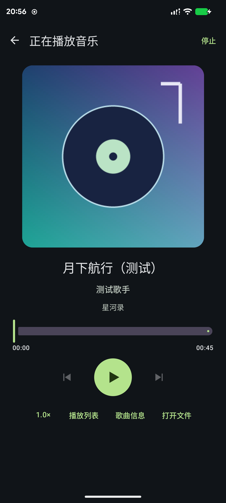
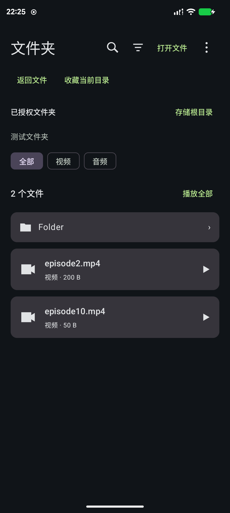
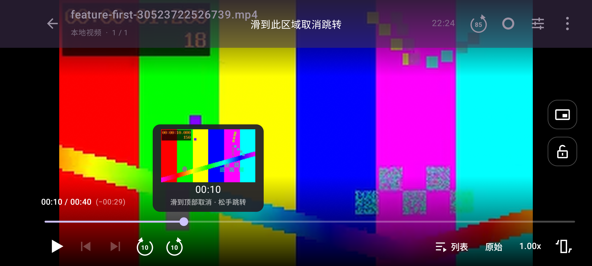
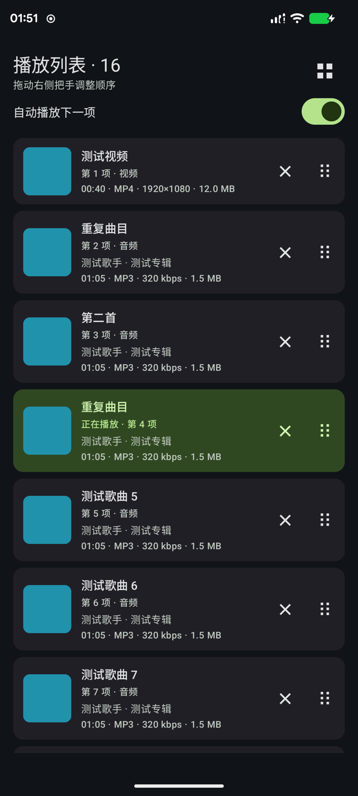
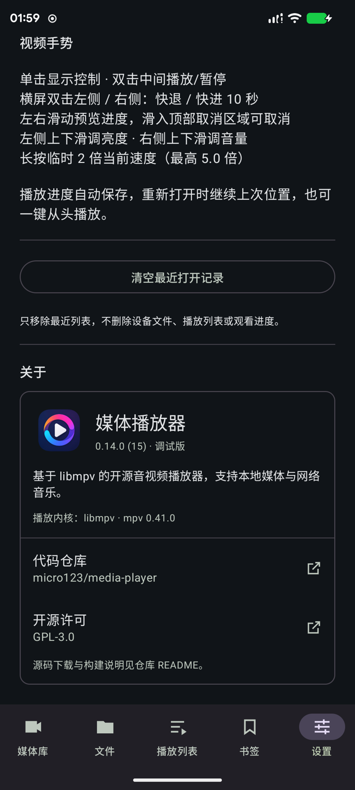

# 媒体播放器 · Media Player

[](https://github.com/micro123/media-player/actions/workflows/build.yml)
[](https://github.com/micro123/media-player/releases/latest)


[](LICENSE)

基于 **libmpv** 的 Android 音视频播放器，使用 Kotlin、Jetpack Compose 和 Material 3。
支持安卓媒体库、本地文件、SMB/NFS 网络目录、Navidrome 音乐服务器、M3U 播放列表与书签，为视频和音乐提供独立播放界面。

A libmpv-powered Android media player with local browsing, SMB/NFS, playlists and dedicated video/music interfaces.

**当前版本：0.12.1** · **应用 ID：`io.github.micro123.mediaplayer`** · **最低 Android 8.0**

## 下载与安装

从 [GitHub Releases](https://github.com/micro123/media-player/releases) 下载对应架构的 APK，按系统提示安装。
0.12.1 起提供四个单架构包和一个通用包，全部使用固定发布密钥签名。普通 64 位 ARM 手机优先选择 **arm64-v8a**，Moto X40 使用这一版。

| 文件名后缀 | 约大小（0.12.1） | 适用设备 |
| --- | --- | --- |
| `-arm64-v8a.apk` | 26 MiB | 支持 64 位 ARM 应用的手机/平板，推荐优先选择 |
| `-armeabi-v7a.apk` | 24 MiB | 使用 32 位 ARM 应用环境的设备 |
| `-x86_64.apk` | 31 MiB | 64 位 x86 环境，例如相应模拟器 |
| `-x86.apk` | 29 MiB | 32 位 x86 环境 |
| `-universal.apk` | 103 MiB | 包含全部四种架构；不确定设备架构时使用，体积较大 |

例如 `media-player-0.12.1-arm64-v8a.apk`。每个 APK 都是完整安装包，**只选一个安装即可**。
分包保留原有解码能力，只排除其他 CPU 架构的原生库；包名、版本号和签名相同，可从 0.12.0 正式版覆盖升级。

0.12.0 开始使用新的应用 ID，可与此前的 `com.tang.player` 测试版并存。旧版设置、书签和观看进度不会自动迁移。
日常开发提交生成的调试 APK 可在 [Actions](https://github.com/micro123/media-player/actions/workflows/build.yml) 对应任务的 Artifacts 中获取；调试版与正式版签名不同，不能互相直接覆盖安装。

Release 附件中的 `SHA256SUMS` 用于校验文件，`BUILD_INFO.json` 记录版本、提交和签名证书指纹；映射 ZIP 用于排查崩溃。普通使用只需下载 APK，源码下载方法见下文。

## 功能

| 功能 | 支持情况 |
| --- | --- |
| 媒体库 | 安卓 MediaStore、音频/视频筛选、最近播放、按文件名前缀与集数自动归类剧集 |
| 文件浏览 | 共享存储与 SAF 文件夹；名称/大小/类型升降序，文件夹置顶；点击搜索图标展开搜索 |
| Navidrome | 专辑、歌手、全部歌曲、服务器播放列表；服务器搜索与分页；原始音频播放、封面及曲目信息；加密账号与位置收藏 |
| 网络位置 | SMB 2/3、NFS v3/TCP 只读浏览和按需播放；HTTP/HTTPS 地址；认证加密保存、位置与目录书签 |
| 播放列表 | 持久队列、播放全部、上一项/下一项、自动下一项、拖拽把手排序、封面 / 缩略图预览及媒体信息、M3U 导入/导出 |
| 视频 | 全屏播放，默认横屏，可配置竖屏或保持；原始/4:3/16:9 比例；主动进入系统画中画 |
| 音乐 | 独立封面与 ID3 信息界面，适配竖屏和横屏；迷你播放器、后台播放、系统媒体通知与锁屏控制 |
| 关于 | 设置页底部显示应用版本、播放内核、开源许可和代码仓库入口 |
| 倍速 | 0.1～5.0，滑块与快捷档位、可记住全局倍速；长按临时使用当前速度的 2 倍，最高 5.0 |
| 观看进度 | 自动保存和续播；可配置 OP/ED 快速跳过，默认 85 秒 |
| 手势 | 单击显隐控制，横屏左右双击 ±10 秒，中间双击播放/暂停；亮度、音量、可取消进度拖动 |
| 跳转预览 | 拖动期间暂停，进度条显示候选位置和本地缩略帧；移到顶部取消区可放弃，结束后恢复原状态 |
| 区间录制 | 同一个按钮开始/结束标记，导出原速无损 MP4；实际开始点可能对齐较早关键帧 |
| 外部打开 | 支持文件管理器「打开方式」播放音视频，使用发送方提供的单文件读取授权 |

视频退出播放界面或普通 Home 离开时保存进度并停止；主动进入画中画才继续小窗播放。
音乐返回浏览、切换应用、锁屏或关闭播放页面后会继续播放；移除最近任务也会继续。系统媒体通知显示封面、曲名、歌手 / 专辑和播放状态，提供播放 / 暂停、上一首 / 下一首与进度控制；点击通知返回音乐界面。点击播放器的停止按钮或结束媒体通知会停止音乐并移除通知。

目前没有字幕/音轨选择或系统画中画以外的悬浮窗。系统强行停止应用后不会自动恢复播放。
网络视频支持跳转时间预览；缩略帧预览目前仅支持本地文件。
NFS 当前支持 v3/TCP，SMB 当前不使用 Kerberos；网络源按需读取，不预先下载完整媒体文件。

## 界面预览

截图使用项目自建测试素材；部分截图来自 0.9/0.11 版本。

<p>
  
  
</p>



## 构建

需要 **JDK 25**、**Android SDK Platform 37.0**、**Build Tools 36.0.0**，使用项目自带的 Gradle Wrapper。
Android Studio 打开项目根目录后，配置 Gradle JDK，安装对应 SDK 并等待同步完成。
SDK 路径通过本机 `local.properties` 或 `ANDROID_HOME` 设置，不随源码提交。

```sh
git clone git@github.com:micro123/media-player.git
cd media-player

# 确保 JAVA_HOME 指向 JDK 25。
./gradlew :app:assembleDebug :app:lintDebug :app:testDebugUnitTest
```

Debug APK：`app/build/outputs/apk/debug/app-debug.apk`。
不需要本机 NDK 或 CMake：固定版本 `dev.jdtech.mpv:libmpv:1.0.0` AAR 已提供四种 ABI。

构建签名正式包需先准备未纳入 Git 的 `keystore.properties` 与密钥库，见 [签名与打包](docs/release-signing.md)：

```sh
./gradlew :app:assembleRelease -PsplitApks=true
```

Release APK：`app/build/outputs/apk/release/app-架构-release.apk`，通用包为 `app-universal-release.apk`。
未传 `-PsplitApks=true` 时仍生成单个通用 `app-release.apk`，日常 debug 构建保持原有产物路径。
项目源码不包含发布密钥；克隆仓库后可以直接构建调试版，不能使用项目维护者的签名身份。

## GitHub Actions 与发布

- **Android CI**：提交到 `main`、向 `main` 提交 PR 或手动触发时运行单元测试、lint，构建调试 APK 与设备测试 APK，上传调试安装包和检查报告。
- **Android Release**：推送 `v*` 标签时检查标签与源码版本一致，再测试、按架构构建并逐个验证签名，创建 GitHub Release，附带四个单架构 APK、通用 APK、校验文件、构建信息和混淆映射。
- 签名凭据保存在仓库 Actions Secrets，PR 构建不读取发布密钥；发布工作流可手动选择已有版本标签重试。

发布版本号由 `gradle.properties` 中的 `appVersionName` 与 `appVersionCode` 管理。详细步骤见 [自动构建与发布](docs/github-actions.md)。

## 项目结构

```text
app/                           Compose 界面、浏览来源、媒体库、书签与持久设置
core/player/                   播放接口、libmpv 内核与来源句柄管理
gradle/libs.versions.toml       固定插件与依赖版本
.github/workflows/             日常 CI 与签名发布
tools/ci/                      签名恢复、版本检查与发布附件打包
tools/network-test-server/     自建 SMB/NFS 隔离测试服务器
docs/                          功能说明、发布流程与验证记录
THIRD_PARTY_NOTICES.md          原生及网络依赖来源与许可声明
```

来源注册表、目录浏览和播放输入解析相互独立。本地 content/file、HTTP、SMB 与 NFS 均使用稳定地址保存队列和观看进度；网络代理文件描述符支持随机读取和跳转。

## 播放列表预览与排序

列表页与播放界面中的列表共用拖拽把手，拖动至边缘会自动滚动。当前播放项单独标记，排序不会切换播放中的曲目。
音乐项显示封面、歌手 / 专辑、时长、格式、码率和大小；本地视频项显示缩略图、时长、格式、分辨率和大小。
设置页底部的「关于」提供当前版本、播放内核、GPL-3.0 许可和 GitHub 代码仓库入口。

<p>
  
  
</p>
没有封面或无法读取信息时保留类型图标，未知字段不显示；普通 HTTP 直播和 SMB/NFS 视频当前不额外下载缩略图。

预览只为可见项目按需读取，最多两个并发读取任务；内存缓存上限 8 MiB，磁盘缓存上限 64 MiB / 400 项，7 天后过期。
磁盘缓存位于应用缓存目录，可从 Android 应用设置清除缓存，清除不会删除媒体、书签或服务器配置。

## Navidrome 音乐服务器

在「文件 → 添加网络位置」中选择 **Navidrome**，填写服务器首页地址、用户名和密码，点击「保存并连接」。
地址可包含反向代理子路径，例如 `https://music.example.com/navidrome`；不要填写 `/rest` API 地址。
服务器支持 Subsonic 1.16.1 / OpenSubsonic 接口，不要求开启 Navidrome 原生管理 API。

入口提供专辑、歌手、全部歌曲与服务器播放列表，搜索图标可搜索整个服务器的歌曲、专辑和歌手。
专辑、全部歌曲与搜索结果分页浏览；「播放全部歌曲」会自动收集所有页面，从第一首建立完整队列，不受当前浏览页限制。
搜索结果的「播放全部歌曲」仅播放匹配歌曲；专辑和服务器播放列表保留原有曲目顺序与重复曲目。
收集时显示已读取数量，可取消；取消、网络失败或分页异常会保留原队列。此操作只读取曲目元数据，不下载完整音乐文件。
音乐界面显示服务器提供的封面、歌手、专辑、年份、流派和曲目信息，播放使用原始音频并支持进度跳转与倍速。
浏览位置可收藏，队列可保存为播放列表书签或导出 M3U。

账号密码由 Android Keystore 加密保存，队列、历史与 M3U 仅保存服务器配置标识和曲目 ID。
导出的 Navidrome M3U 是本应用的稳定地址格式，重新导入时需保留匹配的服务器配置；其他播放器不会识别这些地址。
连接外网时建议使用 HTTPS。服务器列表为只读，当前不包含离线下载、写入服务器播放列表或收藏、歌词、服务端播放统计。

## 反馈与贡献

请通过 [Issues](https://github.com/micro123/media-player/issues) 提交问题或功能建议，附上应用版本、Android 版本、来源类型和复现步骤。
构建与验证约定见 [贡献说明](CONTRIBUTING.md)，代码管理见 [Git 工作流](docs/git-workflow.md)。
设备测试使用自建音视频、独立网络服务器和测试文件管理器，不依赖真实 NAS 账号或用户媒体。

## 文档与第三方依赖

项目原创源码采用 **GPL-3.0-only**，完整条款见 [LICENSE](LICENSE)。第三方组件保留各自的许可证和版权声明。

### 源码下载与重建

应用源码可从每个 [Release](https://github.com/micro123/media-player/releases) 的 **Source code (zip / tar.gz)** 下载，或检出与安装包匹配的版本标签：

```sh
git clone --branch v0.14.0 https://github.com/micro123/media-player.git
cd media-player
./gradlew :app:assembleDebug
```

应用使用未经修改的 `dev.jdtech.mpv:libmpv:1.0.0` AAR。其对应的 JNI 包装层、原生依赖版本、补丁和构建脚本来自 [libmpv-android v1.0.0](https://github.com/jarnedemeulemeester/libmpv-android/tree/v1.0.0)。
下载该版本并运行上游脚本，即可取得固定版本的 mpv、FFmpeg 及其他原生依赖源码并重建：

```sh
git clone --depth 1 --branch v1.0.0 https://github.com/jarnedemeulemeester/libmpv-android.git
cd libmpv-android/buildscripts
./download.sh
./patch.sh
./build.sh
```

只获取依赖源码而不安装 SDK、NDK，可在 `buildscripts` 目录运行 `bash include/download-deps.sh`。
下载脚本使用 [depinfo.sh](https://github.com/jarnedemeulemeester/libmpv-android/blob/v1.0.0/buildscripts/include/depinfo.sh) 固定版本，其中 mpv 为 **0.41.0**、FFmpeg 为 **8.1**。
原生构建的环境要求和 AAR 构建步骤见 [上游构建说明](https://github.com/jarnedemeulemeester/libmpv-android/blob/v1.0.0/buildscripts/README.md)，完整组件列表见 [第三方声明](THIRD_PARTY_NOTICES.md)。
日常 APK 构建使用预编译 AAR，GitHub Actions 不下载或重新编译这些原生源码。

- [0.14.0 播放列表与完整歌曲播放](docs/releases/0.14.0.md)
- [0.13.0 Navidrome 支持](docs/releases/0.13.0.md)
- [0.12.0 发布说明](docs/releases/0.12.0.md)
- [0.12.1 架构分包说明](docs/releases/0.12.1.md)
- [文件排序、区间录制与可取消跳转预览](docs/browsing-and-gestures-0.11.md)
- [文件管理器打开与应用图标](docs/external-open-and-icon-0.10.md)
- [独立音乐界面](docs/music-player-0.9.md) · [视频方向策略](docs/video-orientation-0.9.md)
- [网络位置与来源实现](docs/network-locations-0.7.md) · [文件与网络浏览](docs/files-and-network-0.8.md)
- [剧集归类](docs/media-series-0.5.md) · [M3U、书签与片段导出](docs/sources-bookmarks-clips-0.6.md)
- [第三方依赖及对应源码入口](THIRD_PARTY_NOTICES.md)

libmpv JNI 包装层使用 MIT，原生 mpv/FFmpeg 构建包含 GPL 组件；各组件许可证不能仅按包装层的 MIT 计算。
依赖声明随 APK 打包在 `assets/licenses`，详细版本、上游源码和构建入口见第三方依赖说明。
