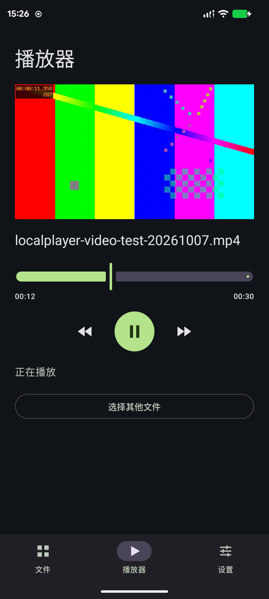

# 0.2.0 原生播放测试

测试日期：2026-10-07（Asia/Shanghai）。
设备：moto X40，Android API 36，arm64-v8a。
应用：com.tang.player，versionCode 2，versionName 0.2.0。

## 构建与打包

- `:app:assembleDebug`：通过。
- `:app:assembleDebugAndroidTest`：通过。
- `:app:assembleRelease`：通过，包括 R8 压缩、资源缩减及 lintVital。
- `:app:lintDebug`：0 错误、12 条插件或依赖版本更新提示。
- Debug APK v2 签名验证：通过。
- Debug APK zipalign 的 16 KiB APK ZIP 对齐检查：通过；不代表逐个 native ELF 的完整兼容性认证。
- APK 中确认包含四种 ABI 的 libmpv.so、libplayer.so 及 FFmpeg 依赖。
- Debug APK 约 112 MiB；Release APK 约 102 MiB，Release 产物未签名。
- 真机测试运行 Debug 产物；Release 当前验证到构建与压缩阶段。

## 原生仪器测试

最终安装 APK 的结果：`OK (4 tests)`，耗时 7.736 秒。
测试直接运行实际 libmpv native 库，不使用模拟引擎。

| 测试 | 覆盖 | 结果 |
| --- | --- | --- |
| contentUriPlayPauseSeekEndAndReplay | 自建 MediaStore content URI；播放、时长、进度、暂停稳定性、暂停时 seek、恢复、结束、重播 | 通过 |
| invalidInputReportsErrorAndNextFileRecovers | 损坏媒体、不存在文件、错误提示、后续正常文件恢复 | 通过 |
| replacementStopAndReleaseCloseDescriptors | 重复替换、快速连续加载、最后文件生效、stop、重复 release、释放后命令安全；通过 /proc/self/fd 检查测试文件描述符 | 通过 |
| audioFocusLossPausesPlayback | 另一个焦点请求导致原引擎暂停 | 通过 |

测试样本是 8 秒 16 kHz 单声道静音 WAV，避免设备测试打扰用户。
使用应用自己创建的 MediaStore 条目，结束后删除条目和 cacheDir 下的测试文件。

首次测试发现两处测试工具问题：/data/user/0 的缓存路径与实际 /data/data 别名不同，
已改为 canonicalPath 比较；系统的 AUDIO_BECOMING_NOISY 是受保护广播，
已改用真实音频焦点争抢测试。未将受保护广播的模拟发送列为通过项。
耳机拔出接收代码已接入，但本次未进行实体耳机插拔验证。

## 手动视频验证

由 FFmpeg 生成 30 秒、640×360、24 fps 的 H.264/AAC MP4，音轨为静音。
经 ADB 放入 Download，再由应用的系统 OpenDocument 选择器选取。

- 实际动态彩色视频画面可见，并显示 00:30 时长。
- 播放进度持续推进，播放控制可用；暂停后拖动进度条，时间更新到 00:16。
- 返回桌面再回应用：已暂停，点击播放继续。
- 切到文件页再回播放器：Surface 重建后仍显示当前暂停帧。
- 横竖屏切换：视频画面和媒体选择保留；恢复设备原来的 `lock 0` 设置。
- 当前横屏仍是可滚动普通播放页，没有专门的全屏模式。

播放画面证据：

## 测试清理

已删除临时 MP4，并在确认最近列表只含该测试文件后清空其记录。
保留最终 0.2.0 应用，恢复锁定竖屏；未清除用户应用数据或修改设备上的原有媒体文件。

## 范围

视频解码已验证，但本次没有人工试听真实有声素材，也未覆盖所有编码格式和设备。
MediaCodec 在测试设备的 Surface 切换日志中出现不可用提示，内核能回退并继续输出画面；
本次不声明已验证硬件解码命中。
后台播放、媒体通知、字幕与音轨选择、画中画仍未实现。
