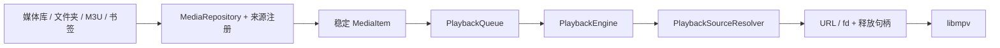

# 来源、M3U、书签、区间录制与同步 0.6.0

本次保留媒体库/文件夹/剧集的浏览与全屏播放流程，新增独立“书签”导航。
返回或普通后台仍停止视频，主动进入画中画才继续播放；系统保存文件窗口也会停止视频，
已完成的起止区间单独保留，因此文件窗口返回后仍能导出，不重新启动视频。

## 来源及队列边界

- core 的 MediaItem 保存稳定 URI/URL 和显示元数据，不保存临时 fd 或网络连接。
- core 的 PlaybackQueue 不依赖媒体来源，现有 PlaylistState 为兼容别名。
- app 的 MediaSourceProvider 提供来源能力、解析媒体及可选目录列表；MediaSourceRegistry 按类型分派。
- MediaRepository 负责媒体解析和历史。本地/HTTP 已接入；LocalMediaRepository 仅为旧测试兼容别名。
- core 的 PlaybackSourceResolver 在原生工作线程打开输入，返回 OpenedMediaSource；关闭回调幂等，
  会在旧 mpv session 销毁后执行。本地使用 fd://，HTTP 使用 URL。
- AppContainer 可同时注入元数据/目录来源及原生输入解析器；后续 SMB/NFS 可以返回受控 fd/流桥接，
  不需要修改队列、进度、播放控件、M3U 格式或书签存储。
- SMB/NFS 本版只保存位置；没有集成协议客户端、账号认证、NAS 发现或远程目录浏览。
  未接入的来源明确提示，不把网络 URL 当本地文件路径。

## 网络入口与位置书签

媒体库右上“浏览选项 → 打开网络地址”，或书签页“添加网络位置”。
HTTP/HTTPS 媒体交给 libmpv，M3U/M3U8 地址先按播放列表处理。
输入完整地址即可播放，也可以填写名称后保存；SMB/NFS 地址可先收藏，点击时提示等待适配器。
支持编辑位置和删除书签。

书签存于独立的 saved_bookmarks 偏好文件，最多 200 个，不和自动观看进度混在一起。
地址校验要求明确支持的协议、服务器和有效端口；账号密码不能嵌入 URL，认证留待协议接入时独立设计。
HTTP 明文入口用于局域网媒体，HTTPS 同时保留；Android 17/API 37 的网络入口包含本地网络权限请求，
拒绝时保留书签且提示，Android 16 不主动触发新增权限。

当前手机上的网络验证存在环境限制：在已授予 INTERNET 的应用/测试进程中，
android.system.Os.socket 对 IPv4 和 IPv6 都立即返回 ECONNREFUSED，Java ServerSocket 也失败，
尚未执行应用的 HTTP 下载/播放逻辑。网络端到端用例明确跳过，不计为通过。
未重启手机、修改网络策略、关闭安全设置或访问外部测试服务器。
因此 HTTP/HLS 播放和网络区间导出不能宣称已完成本机端到端验证。

## M3U 播放列表

播放列表页增加“导入 M3U”“导出 M3U”“保存列表书签”，媒体库浏览选项也可导入。
导入追加到现有队列，按 URI 去重，不自动开始播放，不导入网络命令或执行指令。

- 支持 UTF-8、BOM、CRLF、普通 M3U、EXTM3U/EXTINF 标题。
- 保留标题及列表顺序；媒体打开时保留列表标题，而不被文件名覆盖。
- file:// 列表的相对路径按列表文件目录解析，支持空格、方括号、反斜杠和文件名中的 #。
- SAF 的 content:// 列表没有可推导的文件系统目录，遇到相对路径时请求选择所在文件夹；
  通过文档提供方查找子文件，不能逃出授权目录。绝对 content/file/HTTP 地址直接解析。
- 本地绝对文件路径仍需要对应的读取权限；不额外推导或扩大授权。
- 网络相对路径按最终重定向 URL 解析，避免列表重定向后引用错误目录。
- HTTP 下载限制 2 MiB、最多 5 次重定向、连接/读取各 10 秒；校验每次重定向协议及地址。
- 最多 5000 项；无效或无法读取的项跳过并报告数量；没有有效项时保留原队列并报错。
- #EXT-X-* 的 HLS m3u8 作为单个 HTTP 流交给 mpv，不把 TS 分片加入队列。
  本地 HLS 分片/密钥路径尚未接入，明确提示使用 HTTP HLS 地址。
- 导出 M3U 保存绝对 URI/URL 和显示名称，通过系统新建文档窗口选择位置。
  本地 content:// 引用及其授权只保证当前设备/app 可继续读取，导出不是跨设备媒体打包。

## 命名时间点与列表书签

视频更多操作“保存播放位置书签”，填写名称保存当前媒体和时间点。
打开该书签时，显式时间点优先于当前文件的自动续播位置，不改写原来的自动续播规则。

播放列表页“保存列表书签”保存当前顺序和显示名称；书签页“添加到播放列表”追加该列表，
按 URI 去重，不自动播放。两种书签均能独立删除。

## 区间录制

视频更多操作“区间录制”：标记起点，返回观看，到终点再次打开并标记终点。
起点存在时，播放画面显示“区间起点 · 标记终点”快捷入口；可重设起点或清除区间。
暂停时也能标记，通过已有进度控件调整位置。

AndroidClipExporter 实现 ClipExporter 接口，后续可以换用转码或网络适配导出器。
本版使用 MediaExtractor + MediaMuxer 复制原始轨道到 MP4，不录制 UI，也不使用播放倍速作为输出时间轴。
导出前检查轨道和前一个关键帧，显示实际起止范围；检查完成后才允许选择保存位置。

支持 H.264/H.265、MPEG-4/3GPP 等 MP4 兼容视频，以及 AAC/AMR 等兼容音频轨道。
有不兼容音轨会报错，不悄悄生成无声片段。加密轨道不导出；字幕、精确帧转码未实现。
无损起点向前对齐关键帧，长 GOP 视频可能明显早于标记时间；例如测试视频的 10～15 秒
会显示实际 0～15 秒，而不是声称能精确得到 5 秒片段。
输出使用各轨道原始时间戳减去同一原点，保留原速和相对音画时间；按轨道处理终点与 B 帧顺序。
导出失败删除部分新建输出，不覆盖原视频。

## 5 倍速同步调整

用自建 60 秒 1920×1080/30 fps H.264 + AAC 有声视频，在同一 moto X40 上测量 mpv avsync 属性。
原配置以 vo=null 提前加载，实际落到 mediacodec-copy，并出现 Surface 缺失日志。
5 倍速稳态采样最大绝对误差为 3105.83 ms。

改为等待 Surface/vo=gpu 后启动视频，优先 mediacodec，依次回退 mediacodec-copy/auto；
无画面探测场景等待最多 500 ms 后启动。使用 video-sync=audio、framedrop=vo、
音高校正及较短音频缓冲；跨入/离开 3 倍以上速度时，对已加载、可跳转且未结束的媒体
使用相对精确 seek 0 刷新旧节奏缓冲。不对不可跳转直播执行这个重同步。

同一素材修复验证采样最大误差 43.93 ms，实际 hwdec-current 为 mediacodec；恢复 1 倍也通过检查。
这些是内核时钟指标，不能代表所有视频/音频设备上的绝对延迟；不承诺所有 4K/高帧率/软件解码文件
都能在 5 倍速下保持相同效果。最终完整回归的最新测量及用例结果见下方。

## 验证

2026-10-07，Debug 0.6.0 / versionCode 6 已安装到 moto X40（Android 16 / API 36）。

- Debug、AndroidTest、Release 构建通过；Release 产物为未签名构建验证，不是已安装包。
- 40 项 JVM 测试全部通过：22 项剧集归类、12 项 M3U/地址/适配器、6 项 HTTP 下载与重定向边界。
  HTTP 下载测试使用可控连接回复验证协议逻辑，不等同于实际联网播放。
- 最终完整真机回归总计 23 项：22 项通过，1 项 HTTP 端到端用例因上述底层 socket 环境限制跳过，
  无失败，耗时 85.640 秒。跳过项未计入“通过”。
- 通过项包含 5 项实际 libmpv 内核测试，既有播放、进度、倍速、长按、手势、全屏方向、
  画中画及退出停止流程，以及命名书签持久化、M3U 本地导入/导出、片段原速音视频导出后再播放、
  网络位置/列表/时间点/区间弹窗的 UI 操作。
- 新 UI 用例另有专项通过记录（10.083 秒）；截图仅包含自建媒体及自建书签。
- 同步专项修复验证最大绝对 avsync 为 43.93 ms；最终完整回归也通过 5 倍速误差小于 300 ms
  以及恢复 1 倍小于 100 ms 的断言。不把单项素材结果推广到所有设备/文件。
- Lint 无错误，14 项警告为既有工具/依赖更新、所有文件权限商店政策及测试依赖版本目录建议。
- Debug APK 签名和 16 KB ZIP 对齐校验通过。
- 测试清理自建素材/书签，恢复原播放列表、历史与偏好；没有清空用户数据。

界面截图：

- [命名位置、列表和网络书签](screenshots/bookmarks-0.6.png)
- [网络位置输入](screenshots/network-location-0.6.png)
- [M3U 与列表书签入口](screenshots/playlist-m3u-0.6.png)
- [区间标记与实际导出范围](screenshots/clip-range-0.6.png)

最终仪器测试输出及联网跳过状态见 [验证输出](verification-0.6.txt)。
